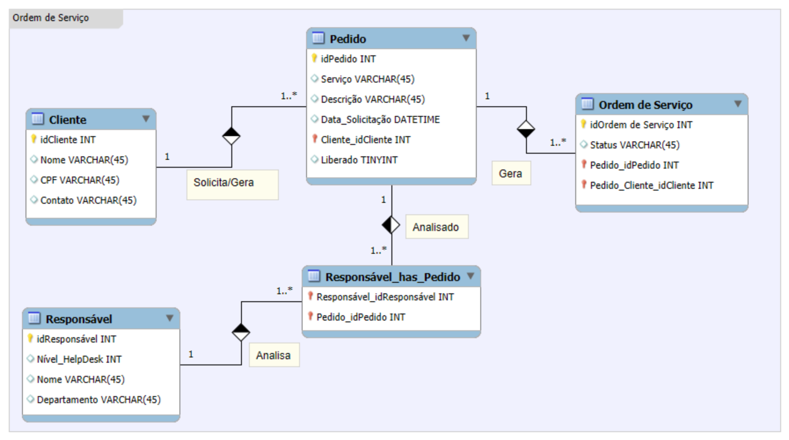
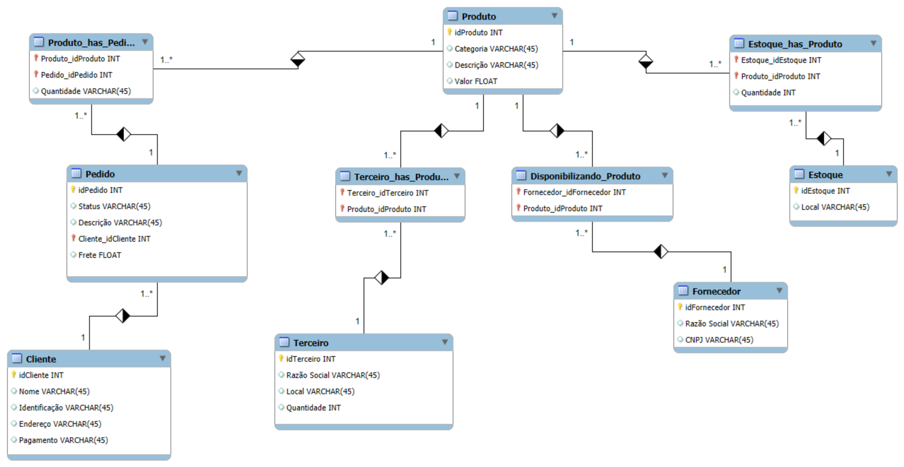
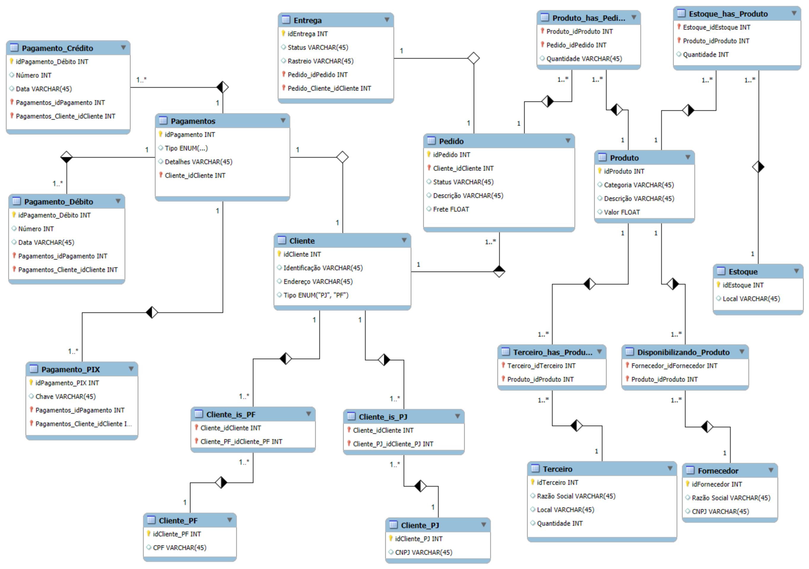

# projetoConceitualBD_DIO

### ✅ `os.mwb` – Modelo Ordem de Serviço
Primeiro rascunho do sistema, com foco em:
- Clientes solicitando Pedidos
- Pedidos gerando Ordens de Serviço
- Responsáveis analisando pedidos

📌 Tabelas principais: `Cliente`, `Pedido`, `Ordem de Serviço`, `Responsável`

📸 Diagrama:  

---

### ✅ `v1.mwb` – Versão 1
Modelo com foco em:
- Relacionamento entre `Pedido` e `Produto`
- Estoque e fornecedores
- Terceiros como revendedores

📌 Novas tabelas: `Produto`, `Estoque`, `Fornecedor`, `Terceiro`

📸 Diagrama:  

---

### ✅ `v2.mwb` – Versão 2 (Completa)
Modelo completo com:
- Pagamentos detalhados por tipo: `Crédito`, `Débito`, `PIX`
- Separação de clientes PF e PJ com herança
- Entregas, rastreamento e frete

📌 Novas entidades: `Cliente_PF`, `Cliente_PJ`, `Pagamento_Crédito`, `Pagamento_PIX`, `Entrega`

📸 Diagrama:  

---

## 💡 Tecnologias

- Modelagem: [MySQL Workbench](https://www.mysql.com/products/workbench/)
- Exportação de imagens: PNG
- Modelos em `.mwb` prontos para edição e uso

---

## 🧑‍💻 Autor

**Arédio G. Borges Filho**  
Desenvolvedor Full Stack | IT Manager  
📧 [aredio.filho@gmail.com](mailto:aredio.filho@gmail.com)  
🔗 [LinkedIn](https://www.linkedin.com/in/aredio)

---

## 📜 Licença

Este projeto está licenciado sob a **MIT License**.  
Sinta-se à vontade para usar, modificar e distribuir.
